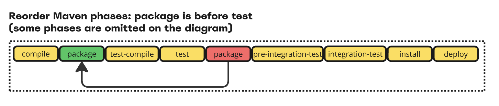

[](https://central.sonatype.com/artifact/com.github.seregamorph/maven-turbo-builder/overview)
[](LICENSE)

# Maven Turbo Builder

See presentation [board](https://miro.com/app/board/uXjVLYUPRas=/?share_link_id=929861907417)

This extension suggests different Maven reactor scheduler behaviour via custom Builder.
By default, to build any module in a multi-module project Maven first resolves and executes all phases of upstream
dependencies. This is a fundamental behaviour which is built-in and strongly enforced because of back compatibility.
This significantly reduces possible parallelism and in a multi-core system cores are loaded unevenly. To enhance
parallelism this extension does two things:
* change the order of `*test*` phases and `*package*`, `package` is executed before `test` (not after as default)
* schedule module build of downstream dependencies when package phase was executed, not waiting for all phases (like
  `test`, `integration-test`, `install`, `deploy`, etc.)

As a result, depending on the particular project, this boosts the build and increases CPU utilization to maximum.

See this example of three modules depending on each other: `test-utils`, `core` and `app`. While this project is
multi-module, Maven by default will build it in a single core even with `-T1C` parameter. This extension will
schedule it in a more efficient way:


The phases are now reordered:



You can check the order of phases with Turbo builder enabled:
```shell
mvn org.codehaus.mojo:buildplan-maven-plugin:list -b turbo
```
the `package` phase now goes before `test-compile` and `test`:
```
-----------------------------------------------------------------------------------------------------------
PHASE                  | PLUGIN                        | VERSION | GOAL          | EXECUTION ID            
-----------------------------------------------------------------------------------------------------------
validate               | maven-enforcer-plugin         | 3.5.0   | enforce       | enforce-bytecode-version
validate               | maven-enforcer-plugin         | 3.5.0   | enforce       | enforce-maven-version   
validate               | maven-enforcer-plugin         | 3.5.0   | enforce       | enforce-java-version    
initialize             | jacoco-maven-plugin           | 0.8.13  | prepare-agent | jacoco-agent            
verify                 | maven-checkstyle-plugin       | 3.6.0   | check         | checkstyle-check        
process-sources        | spotless-maven-plugin         | 2.44.3  | apply         | default                 
generate-resources     | maven-remote-resources-plugin | 3.3.0   | process       | process-resource-bundles
process-resources      | maven-resources-plugin        | 3.3.1   | resources     | default-resources       
validate               | apache-rat-plugin             | 0.16.1  | check         | rat-check               
compile                | maven-compiler-plugin         | 3.14.0  | compile       | default-compile         
package                | maven-jar-plugin              | 3.4.2   | jar           | default-jar             
process-test-resources | maven-resources-plugin        | 3.3.1   | testResources | default-testResources   
test-compile           | maven-compiler-plugin         | 3.14.0  | testCompile   | default-testCompile     
test                   | maven-surefire-plugin         | 3.5.2   | test          | default-test            
process-test-classes   | animal-sniffer-maven-plugin   | 1.24    | check         | signature-check         
install                | maven-install-plugin          | 3.1.4   | install       | default-install         
deploy                 | maven-deploy-plugin           | 3.1.4   | deploy        | default-deploy          
```

To set up the extension add to `.mvn/extensions.xml` in the root of the project
```xml
<extensions>
    <extension>
        <!-- https://github.com/maven-turbo-reactor/maven-turbo-builder -->
        <groupId>com.github.seregamorph</groupId>
        <artifactId>maven-turbo-builder</artifactId>
        <version>0.7</version>
    </extension>
</extensions>
```

To run build with custom Builder:
```shell
mvn clean verify -b turbo
```
To enable this extension by default, add line to `.mvn/maven.config` under root of your project:
```
-bturbo
-T1C
```

Example adoption:
* [Maven Surefire, in combination with Maven Surefire Cached extension](https://github.com/seregamorph/maven-surefire/pull/2) (20% faster build + cache complementary)
* [Maven Surefire, in combination with Develocity Extension](https://github.com/seregamorph/maven-surefire/pull/1) (20% faster build + cache complementary)

Compatibility:
* this extension can be used with [Maven Surefire Cached Extension](https://github.com/seregamorph/maven-surefire-cached)
* this extension can be used with [Develocity Maven Extension](https://gradle.com/help/maven-extension/)

Known limitations:
* this extension is not compatible with [Apache Maven Build Cache Extension](https://maven.apache.org/extensions/maven-build-cache-extension/)
* the `test-jar` dependency (compiled test classes of other module) is not supported, because when downstream dependency is
scheduled to be built, the test-jar is not yet ready. Don't use `test-jar` dependencies in your project. 

Join discussion:
* discussed in the [Maven Developer Mailing List](https://lists.apache.org/thread/m8yd6zk3pb2k1ptyy5fs97mykzlzof3w)
* share your experience and submit [issue](https://github.com/maven-turbo-reactor/maven-turbo-builder/issues)
