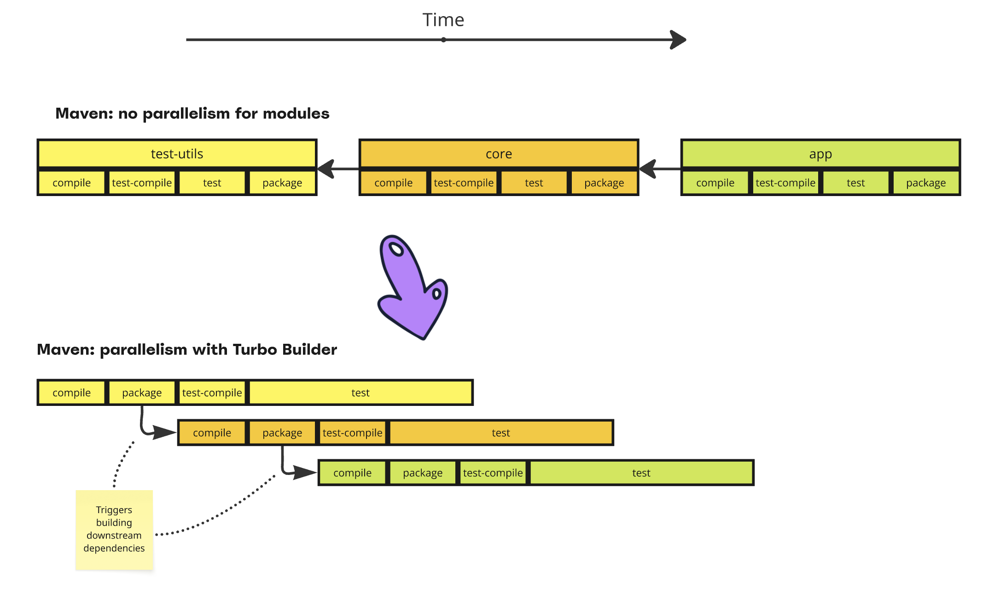

[](https://central.sonatype.com/artifact/com.github.seregamorph/maven-turbo-reactor/overview)
[](LICENSE)

# Maven Turbo Reactor
This project contains Maven extensions to boost builds.

## Maven Turbo builder

See presentation [board](https://miro.com/app/board/uXjVLYUPRas=/?share_link_id=929861907417)

This extension suggests different Maven reactor scheduler behaviour via custom Builder.
By default, to build any module in a multi-module project Maven first resolves and executes all phases of upstream
dependencies. This is a fundamental behaviour which is built-in and strongly enforced because of back compatibility.
This significantly reduces possible parallelism and in a multi-core system cores are loaded unevenly. To enhance
parallelism this extension does two things:
* change the order of `*test*` phases and `*package*`, `package` is executed before `test` (not after as default)
* schedule module build of downstream dependencies when package phase was executed, not waiting for all phases (like
  `test`, `integration-test`, `install`, `deploy`, etc.)

As a result, depending on the particular project, this boosts the build and increases CPU utilization to maximum.

See this example of three modules depending on each other: `test-utils`, `core` and `app`. While this project is
multi-module, Maven by default will build it in a single core even with `-T1C` parameter. This extension will
schedule it in a more efficient way:



To set up the extension add to `.mvn/extensions.xml` in the root of the project
```xml
<extensions>
    <extension>
        <!-- https://github.com/seregamorph/maven-turbo-reactor -->
        <groupId>com.github.seregamorph</groupId>
        <artifactId>maven-turbo-builder</artifactId>
        <version>0.3</version>
    </extension>
</extensions>
```

To run build with custom Builder:
```shell
mvn clean verify -b turbo
```

Example adoption:
* [Maven Surefire, in combination with Maven Surefire Cached extension](https://github.com/seregamorph/maven-surefire/pull/2) (20% faster build)
* [Maven Surefire, in combination with Develocity Extension](https://github.com/seregamorph/maven-surefire/pull/1) (20% faster build)

Compatibility:
* this extension can be used with [Maven Surefire Cached Extension](https://github.com/seregamorph/maven-surefire-cached)
* this extension can be used with [Develocity Maven Extension](https://gradle.com/help/maven-extension/)

Known limitations:
* this extension is not compatible with [Apache Maven Build Cache Extension](https://maven.apache.org/extensions/maven-build-cache-extension/)
* the `test-jar` dependency (compiled test classes of other module) is not supported, because when downstream dependency is
scheduled to be built, the test-jar is not yet ready. Don't use `test-jar` dependencies in your project
